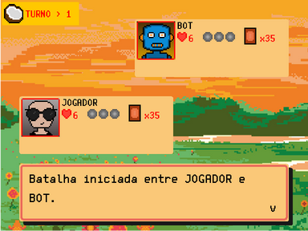
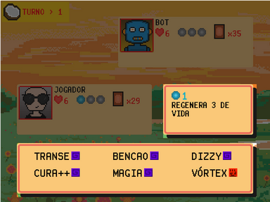

# cgp1

## Introdução

**cgp1** é um protótipo de jogo de cartas por turno desenvolvido como parte do 
**Trabalho de Conclusão de Curso (TCC)** para a **Universidade Estadual de Maringá**.
O jogo oferece um sistema de batalha onde os jogadores se enfrentam utilizando cartas
disponíveis em seus baralhos, com diferentes poderes e habilidades, onde o objetivo é
zerar a vida do oponente.

O objetivo do **TCC** foi desenvolver o **jogo de cartas por turno** e implementar
duas **Inteligências Artificias simples**, com diferentes abordagens, e avaliar o desempenho
delas. A implementação das IAs permite ao jogador enfrentar o computador, e as duas abordagens são comparadas 
em termos de desempenho e eficácia no jogo.

Para mais detalhes em relação a implementação e metodologias, acesse o [TCC](./tcc/tcc.pdf).


## Preview

Segue abaixo algumas imagens do jogo como preview:





## Tecnologias Utilizadas

- **Java 17** ou superior
- **Maven** (para compilar e gerenciar o projeto)
- **Make** (para rodar os scripts de build)

## Como rodar o projeto

1. Clone o repositório:
    ```bash
    git clone https://github.com/dasdwqdf/cgp1
    ```

2. Acesse o diretório do repositório clonado:
    ```bash
    cd cgp1
    ```
   
3. Execute o Makefile:
    ```bash
    make run
    ```

    Ou, se preferir, você pode rodar diretamente com Maven:
    ```bash
    mvn clean package
    java -jar target/cgp1-1.0-SNAPSHOT.jar
    ```
   
## Dúvidas e Contato

Se você tiver dúvidas sobre o projeto ou precisar de mais informações,
fique a vontade para entrar em contato.

- **E-mail**: contato.victorhugonascimento@gmail.com
- **Github**: [https://github.com/dasdwqdf/cgp1](https://github.com/dasdwqdf/cgp1)